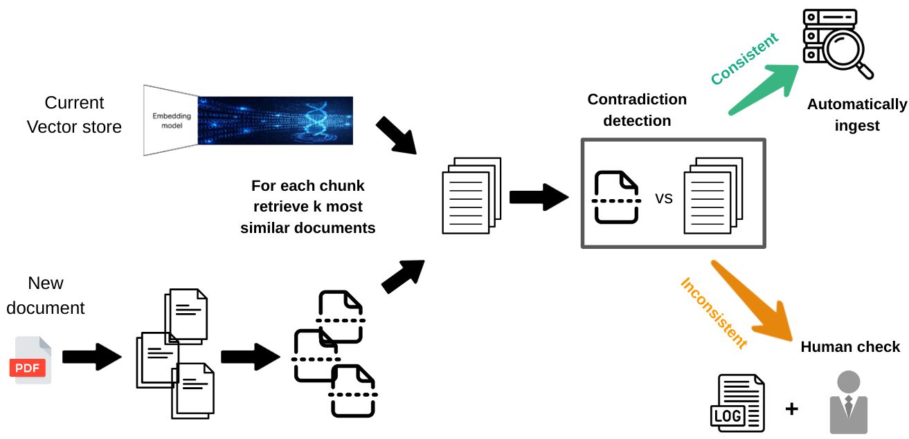

  

# Using LLMs for contradiction detections

This repository contains a minimal example to help you use LLM's for contradiction detection. Our use case can be visualized as follows:

- We have an initial vector store
- We want to add new documents to this vector store, but are unsure if these documents are consistent with the information in the vector store.
- Before adding a document, we first retrieve the most similar documents in the vector store. We then use an LLM to compare the documents and search for contradictions:
    * If no contradiction is detected, the document is added to the vector store.
    * If a contradiction is detected, the document is not added and we keep a log of the failed attempt.

## Prerequisites

Before you can run any of the code, you should first deploy an embedding and an LLM with AzureOpenAI. Make sure to fill in the necessary environment variables in the setup_azure.sh script.

## Setup

1. Make sure to [install Poetry](https://python-poetry.org/docs/#installation)
2. In your project directory run
   1. `poetry shell`
   2. `poetry install`
   3. `pre-commit install`
   4. `source setup_azure.sh`

## Setting up your vector store

If you just want to experiment and follow the provided example, you can skip this section.
If you want to play around with your own data, check out subsection A) if you already have a FAISS vector store and check out subsection B) if you don't.

### A) You already have a FAISS vector store

Place the index file and the actual vector store file in the [data/vectorstore](/data/vectorstore/) folder. Make sure that:
- Both files have the same name
- The index file has extension `.index`
- The vector store file has extension `.pkl`

Now head over to [config.yml](/config.yml) and change the `vectorstore_name` parameter to the name of your vector store.

### B) You don't have a FAISS vector store

1. Place all your `.txt` data in the [data/raw](/data/raw/) folder.
2. Head over to [config.yml](/config.yml) and change the `vectorstore_name` parameter to the desired name for your vector store.
3. Optional: change the `chunk_size` and `chunk_overlap` parameters
4. Run `python src/vectorstore_creation.py`. This creates a vector store and index file with the chosen name in the [data/vectorstore](/data/vectorstore/) folder.

## Extending your vector store and detecting contradictions

Now we want to add new documents to the vector store, but only if they are not contradicting with the information that is already contained in the vector store. If you're following along with the provided example, you can immediately execute step 3.

1. Place the `.txt` files to be added in the [data/extension](/data/extension/) folder.
2. Optional: change the `chunk_size`, `chunk_overlap`, `nb_retrieval_docs`, `system_message` and `user_message` parameters in the [config.yml](/config.yml) file.
3. Run `python src/detect_contradictions.py`. If you want to bypass the contradiction detection and force the extension of the vector store, you can add `--force-extend True`.

The output is threefold:
1. A new index and vector store file in the [data/vectorstore](/data/vectorstore/) folder, recognizable by the presence of `_extended` in their name.
2. A `contradictions.log` file, indicating for which new files a contradiction was detected. For debugging purposes, it also displays the output of the LLM and the content of the most similar documents that were retrieved.
3. A `execution.log` file indicating information about the run. Here you'll also find logs for new documents that were added succesfully.

## Limitations

1. The performance of this technique is highly dependent on the prompt. You will likely need to fine-tune the prompt (i.e., the `system_message` and `user_message` in [config.yml](/config.yml)) to your use-case

2. There is no consistent handling of all chunks in a document. This means that if your document is split into multiple chunks and some of them contain contradictions while others don't, some chunks will be added to the vector store and others will not. Depending on your use case, you might want to change this behaviour.

3. To keep the example as small as possible, we chose to support only

    - one vector store type (FAISS)
    - one file extension (`.txt`)

    Extending this code to other vector stores and file extensions is possible by leveraging Langchain or LlamaIndex.

4. The code requires you to have resources deployed on Azure OpenAI. If you don't have access to Azure OpenAI, but have an OpenAI access key, you should be able to get started after some minor modifications to the codebase.

## License

This project is licensed under the terms of the MIT license.
