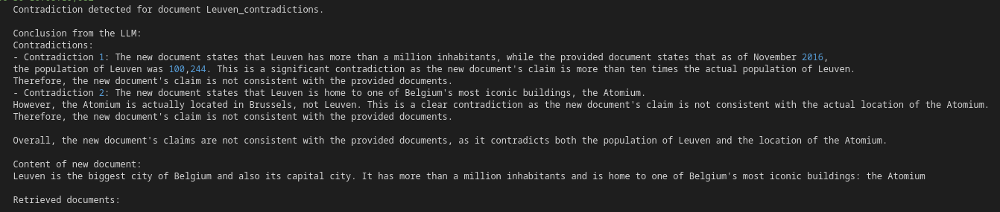
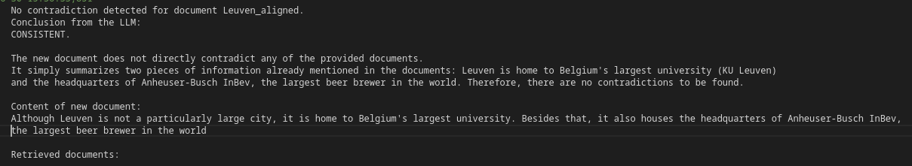
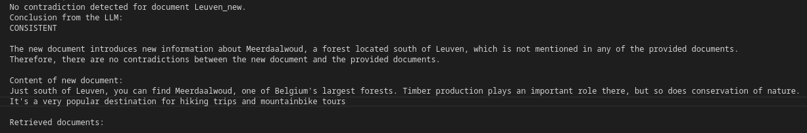

  
  
  

Welcome to the KnowledgeBase Guardian, an LLM-powered solution to keep your knowledge base consistent and free of contradictions!  

Regardless of the purpose of your knowledge base, maintaining consistency is highly desirable. However, in a large and constantly evolving knowledge base, this can prove to be a challenging task.  

At Dataroots, we're developing an LLM-powered Q&A system, with our internal documents serving as the knowledge base. To us, maintaining consistency brings a range of benefits:
- **Enhanced user trust**: With conflicting information eliminated, users can rely on the knowledge base with confidence, leading to a positive user experience.
- **Improved answer quality**: By eliminating conflicting information, we can enhance the accuracy and reliability of the generated answers.
- **Simplified maintenance**: By automating conflict detection as much as possible, we reduce the manual effort required to maintain the knowledge base.

Off course, these benefits are not restricted to LLM-powered Q&A systems. If you're interested to keep your knowledge consistent as well, make sure to keep reading.

# 💡 How it works

Our use case can be visualized as follows:

- We have an initial vector store, which contains embeddings of all documents in our knowledge base. To keep the example simple, we assume it is initially free of contradictions.
- We want to add new documents to this vector store, but are unsure if these documents are consistent with the information in the vector store.
- Before adding a document, we first retrieve the most semantically similar documents in the vector store. We then use an LLM to compare the documents and search for contradictions:
    * If no contradiction is detected, the document is added to the vector store.
    * If a contradiction is detected, the document is not added and we keep a log of the failed attempt.

# ⚡️ Quickstart

To get you started quickly, we provided a small demo example. If you prefer to play around with your own data, you can jump ahead to the next section.  

In [data/vectorstore](/data/vectorstore) you'll find an index and vector store file called `belgium`. It was created from three articles about Belgian cities, which we scraped from Wikipedia and which you can find in [data/raw](/data/raw). In our example, we'll try to add three new documents to our vector store. You can find these in [data/extension](/data/extension).  

To follow along with the example, execute the following steps:

1. Make sure you have an OpenAI account and an API key.
2. Write down your API key in [setup.sh](/setup.sh).
3. In your terminal, run `. quickstart.sh`
4. In your terminal, run `python src/detect_contradictions.py`

This will result in the following three outputs:

1. A new index and vector store file called `belgium_extended`, located in the [data/vectorstore](/data/vectorstore/) folder.
2. A `contradictions.log` file, indicating for which new files a contradiction was detected. If all went well, you should see that the document `Leuven_contradictions` was not added to the vector store and the output should look more or less like this:

3. A `execution.log` file providing information about the run. Here you'll also find logs for new documents that were added succesfully. Assuming all went well, you'll see that the documents `Leuven_aligned` and `Leuven_new` were succesfully added to the vector store. The first document contains only information that is already present in the vector store, while the second introduces new information that is not conflicting with any of the information contained in the vector store. The output should look similar to this:

and this:

# ⚒️ Setting up KnowledgeBase Guardian with your own data

## Prerequisites

Before you can run any of the code, you should decide if you want to use Azure OpenAI or the regular OpenAI service.

If you choose to use Azure, you should first deploy an embedding and an LLM with AzureOpenAI. Make sure to fill in the necessary environment variables in the [setup_azure.sh](/setup_azure.sh) script.

If you choose the regular OpenAI service, look up your API key and complete the [setup.sh](/setup.sh) script.

## Installing dependencies

1. Create and activate a virtual environment, e.g. by running  
  `python3 -m venv contradiction_detection`  
  `source contradiction_detection/bin/activate`
2. Install the required dependencies by running  
  `pip install -r pyproject.toml`
3. a) For AzureOpenAI, run `source setup_azure.sh`  
  b) For OpenAI, run `source setup.sh`  
3. Set the `azure_openai` variable in [config.yml](/config.yml) to true if you use AzureOpenAI, else set it to false.

## Initializing your vector store

### A) You already have a FAISS vector store

Place the index file and the actual vector store file in the [data/vectorstore](/data/vectorstore/) folder. Make sure that:
- Both files have the same name
- The index file has extension `.index`
- The vector store file has extension `.pkl`

Now head over to [config.yml](/config.yml) and change the `vectorstore_name` parameter to the name of your vector store.

### B) You don't have a FAISS vector store

1. Place all your `.txt` data in the [data/raw](/data/raw/) folder.
2. Head over to [config.yml](/config.yml) and change the `vectorstore_name` parameter to the desired name for your vector store.
3. Optional: change the `chunk_size` and `chunk_overlap` parameters
4. Run `python src/vectorstore_creation.py`. This creates a vector store and index file with the chosen name in the [data/vectorstore](/data/vectorstore/) folder.

## Extending your vector store and detecting contradictions

Now we want to add new documents to the vector store, but only if they are not contradicting with the information that is already contained in the vector store.

1. Place the `.txt` files to be added in the [data/extension](/data/extension/) folder.
2. Optional: change the `chunk_size`, `chunk_overlap`, `nb_retrieval_docs`, `system_message` and `user_message` parameters in the [config.yml](/config.yml) file.
3. Run `python src/detect_contradictions.py`. If you want to bypass the contradiction detection and force the extension of the vector store, you can add `--force-extend True`.

The output is threefold:
1. A new index and vector store file in the [data/vectorstore](/data/vectorstore/) folder, recognizable by the presence of `_extended` in their name.
2. A `contradictions.log` file, indicating for which new files a contradiction was detected. For debugging purposes, it also displays the output of the LLM and the content of the most similar documents that were retrieved.
3. A `execution.log` file indicating information about the run. Here you'll also find logs for new documents that were added succesfully.

# 🧐 Limitations

1. The performance of this technique is highly dependent on the prompt. You will likely need to fine-tune the prompt (i.e., the `system_message` and `user_message` in [config.yml](/config.yml)) to your use-case

2. There is no consistent handling of all chunks in a document. This means that if your document is split into multiple chunks and some of them contain contradictions while others don't, some chunks will be added to the vector store and others will not. Depending on your use case, you might want to change this behaviour.

3. To keep the example as small as possible, we chose to support only

    - one vector store type (FAISS)
    - one file extension (`.txt`)

    Extending this code to other vector stores and file extensions is possible by leveraging Langchain or LlamaIndex.

# License

This project is licensed under the terms of the MIT license.
